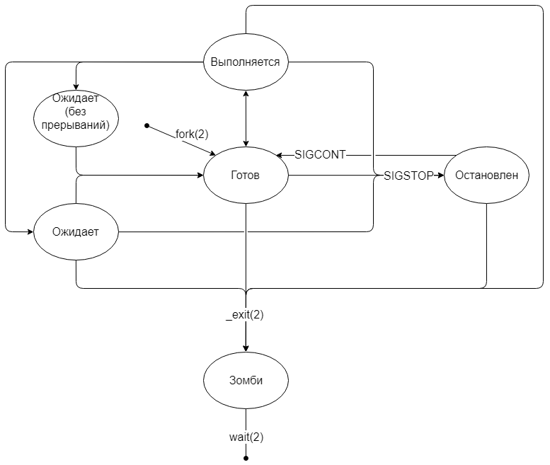

#                                                               1. Управление процессами в linux
##                      1.1 ДЗ по теме управление процессами

-   Задание:

        написать свою реализацию ps ax используя анализ /proc
        Результат ДЗ - рабочий скрипт который можно запустить
        реализовать 2 конкурирующих процесса по IO. пробовать запустить с разными ionice
        Результат ДЗ - скрипт запускающий 2 процесса с разными ionice, замеряющий время выполнения и лог консоли
        реализовать 2 конкурирующих процесса по CPU. пробовать запустить с разными nice
        Результат ДЗ - скрипт запускающий 2 процесса с разными nice и замеряющий время выполнения и лог консоли

Подготовлено 3 скрипта для выполнения ДЗ

**Запуск производить под пользователем root, из папки /vagrant**
___

1.  hw_proc.sh -  Запускается при  первом старте vagrant-a, потомо можно выполнить или командой "vagrant provision" или из папки /vagrant. Cкрипт эмулирующи выполнение команды "ps ax". Для демонстрации работы просто запустить скрипт из рабочей директории пользователя vagrant, после старта Vagrant-а.
При запуске есть небольшая задержка ~6 сек.

[Скрипт эмуляции ps](hw_proc.sh)

___

2.  hw_ionice.sh - скрипт запускающий два процесса записи на диск тестовых файлов размером 2G с разнами приоритетами IO (ionice), и замеряющий время выполнения этих прцессов. Для демонстрации работы просто запустить скрипт из рабочей директории пользователя vagrant, после старта Vagrant-а.

[Скрипт работы ionice](hw_ionice.sh)
___

3.  hw_nice.sh  - скрипт запускающи 2 процесса создания архивов, с разными приоритетами CPU (nice), и замеряющий время выполнения этих прцессов. Для демонстрации работы просто запустить скрипт из рабочей директории пользователя vagrant, после старта Vagrant-а.

[Скрипт работы nice](hw_nice.sh)

---

#                2. Общая теория, примеры, полезности.

##          2.1 Рождение процесса

Только один процесс в системе рождается особенным способом — systemd — он порождается непосредственно ядром. Все остальные процессы появляются путём дублирования текущего процесса с помощью системного вызова fork. После выполнения fork получаем два практически идентичных процесса за исключением следующих пунктов:

1.  fork возвращает родителю PID ребёнка, ребёнку возвращается 0;
2.  у ребёнка меняется PPID (Parent Process Id) на PID родителя.

После выполнения fork все ресурсы дочернего процесса — это копия ресурсов родителя. Копировать процесс со всеми выделенными страницами памяти — дело дорогое, поэтому в ядре Linux используется технология Copy-On-Write.
Все страницы памяти родителя помечаются как read-only и становятся доступны и родителю, и ребёнку. Как только один из процессов изменяет данные на определённой странице, эта страница не изменяется, а копируется и изменяется уже копия. Оригинал при этом «отвязывается» от данного процесса. Как только read-only оригинал остаётся «привязанным» к одному процессу, странице вновь назначается статус read-write.

*   **Состояние "готов"**

        Сразу после выполнения fork(2) переходит в состояние «готов».
        Фактически, процесс стоит в очереди и ждёт, когда планировщик (scheduler) в ядре даст процессу выполняться на процессоре.

*   **Состояние "выполняется"**

        Как только планировщик поставил процесс на выполнение, началось состояние «выполняется». Процесс может выполняться весь предложенный промежуток (квант) времени, а может уступить место другим процессам, воспользовавшись системным вывозом sched_yield.

*   **Перерождение в другую программу**

        В некоторых программах реализована логика, в которой родительский процесс создает дочерний для решения какой-либо задачи. Ребёнок в данном случае решает какую-то конкретную проблему, а родитель лишь делегирует своим детям задачи. Например, веб-сервер при входящем подключении создаёт ребёнка и передаёт обработку подключения ему.

*   **Состояние "ожидает"**

        Некоторые системные вызовы могут выполняться долго, например, ввод-вывод. В таких случаях процесс переходит в состояние «ожидает». Как только системный вызов будет выполнен, ядро переведёт процесс в состояние «готов».
        В Linux так же существует состояние «ожидает», в котором процесс не реагирует на сигналы прерывания. В этом состоянии процесс становится «неубиваемым», а все пришедшие сигналы встают в очередь до тех пор, пока процесс не выйдет из этого состояния.
        Ядро само выбирает, в какое из состояний перевести процесс. Чаще всего в состояние «ожидает (без прерываний)» попадают процессы, которые запрашивают ввод-вывод. Особенно заметно это при использовании удалённого диска (NFS) с не очень быстрым интернетом.

*  **Состояние "остановлен"**

        В любой момент можно приостановить выполнение процесса, отправив ему сигнал SIGSTOP. Процесс перейдёт в состояние «остановлен» и будет находиться там до тех пор, пока ему не придёт сигнал продолжать работу (SIGCONT) или умереть (SIGKILL). Остальные сигналы будут поставлены в очередь.

*   **Завершение процесса**

        Ни одна программа не умеет завершаться сама. Они могут лишь попросить систему об этом с помощью системного вызова _exit или быть завершенными системой из-за ошибки. Даже когда возвращаешь число из main(), всё равно неявно вызывается _exit.
                    Хотя аргумент системного вызова принимает значение типа int, в качестве кода возврата берется лишь младший байт числа.     

*   **Состояние "зомби"**

        Сразу после того, как процесс завершился (неважно, корректно или нет), ядро записывает информацию о том, как завершился процесс и переводит его в состояние «зомби». Иными словами, зомби — это завершившийся процесс, но память о нём всё ещё хранится в ядре.
        Более того, это второе состояние, в котором процесс может смело игнорировать сигнал SIGKILL, ведь что мертво не может умереть ещё раз.  

____

man proc

/proc/[pid]/stat - статус информация о процессах, отсюда её берёт ps

man kill - ман по сигналам
kill -l  -все возможгые сигналы:

    1) SIGHUP       2) SIGINT       3) SIGQUIT      4) SIGILL       5) SIGTRAP
    6) SIGABRT      7) SIGBUS       8) SIGFPE       9) SIGKILL     10) SIGUSR1
    11) SIGSEGV     12) SIGUSR2     13) SIGPIPE     14) SIGALRM     15) SIGTERM
    16) SIGSTKFLT   17) SIGCHLD     18) SIGCONT     19) SIGSTOP     20) SIGTSTP
    21) SIGTTIN     22) SIGTTOU     23) SIGURG      24) SIGXCPU     25) SIGXFSZ
    26) SIGVTALRM   27) SIGPROF     28) SIGWINCH    29) SIGIO       30) SIGPWR
    31) SIGSYS      34) SIGRTMIN    35) SIGRTMIN+1  36) SIGRTMIN+2  37) SIGRTMIN+3
    38) SIGRTMIN+4  39) SIGRTMIN+5  40) SIGRTMIN+6  41) SIGRTMIN+7  42) SIGRTMIN+8
    43) SIGRTMIN+9  44) SIGRTMIN+10 45) SIGRTMIN+11 46) SIGRTMIN+12 47) SIGRTMIN+13
    48) SIGRTMIN+14 49) SIGRTMIN+15 50) SIGRTMAX-14 51) SIGRTMAX-13 52) SIGRTMAX-12
    53) SIGRTMAX-11 54) SIGRTMAX-10 55) SIGRTMAX-9  56) SIGRTMAX-8  57) SIGRTMAX-7
    58) SIGRTMAX-6  59) SIGRTMAX-5  60) SIGRTMAX-4  61) SIGRTMAX-3  62) SIGRTMAX-2
    63) SIGRTMAX-1  64) SIGRTMAX

>
   1    SIGHUP               - отправляется процессу при закрытии контролирующего его терминала.
   2    SIGINT    [Ctrl+C]   - отправляется процессу контролирующим его терминалом, если пользователь прерывает работу процесса клавишами .
   3    SIGQUIT   [Ctrl+D]   - отправляется процессу, если пользователь посылает сигнал выхода из программы.
   9    SIGKILL              - этот сигнал немедленно завершает (убивает) процесс без выполнения любых операций очистки файлов, логов и т.д.
   15  SIGTERM 1             - это сигнал завершения работы программы (он по умоланию отправляется командой kill).
   20 SIGSTP      [Ctrl+Z]   -  отправляет сигнал SIGSTP,  процессу, тем самым прекратив его работу; он простаивает
>

##          Namespaces (пространство имён)

> Просмотр namespace процесса через proc
    ls -l /proc/{pid}/ns

  >  Просмотр namespace процесса через tree
    pstree -S

Утилиты:

*   **unshare** <---- _запустить программу в новом пространстве имен (отделить от родительского)_
    Пример:

        unshare --fork --pid --mount-proc readlink /proc/self
        unshare --map-root-user --user sh -c whoami

*   **nsenter**         <---- _запустить программу в чужом пространстве имен (войтив чужое пространство (Namespaces))_
*   **lsns**                <---- _просмотр текущих Namespaces_
*   **ip netns**         <---- _управление сетевым NS_

##          Утилиты просмотра и управления  процессами, каталог "/proc"

___

*   **iostat            :** <---- _Cредняя загрузка процессора, активность дисков_

___

*   **iotop             :** <---- _IO status_

    Пример запуска с ключами:

          iotop -oPa

___

*   **ps                  :** <---- _Просмотр параметров процессов, команд запуска и т.д._

> man ps - ман по параметрам и ключам утилиты ps

        Многие из задач в выводе ps являются процессами, работающими в фоновом режиме. Те, что взяты в квадратные скобочки — процессы ядра.

-   Значения флагов в выводе ps

            R - процесс выполняется или готов к выполнению (состояние готовности)
            D - процесс в "безпробудном сне" - ожидает дискового ввода/вывода
            T - процесс остановлен (stopped)
            t - процесс остановлен находится в режиме debug трассируется отладчиком
            S - процесс в состоянии ожидания (sleeping) неактивен (< 20 с)
            Z - процесс-зобми
            I - процесс бездействует (т.е. спит больше 20 секунд)

-   Дополнительные флаги:

            W : процесс выгружен на диск
            < : процесс с отрицательным значением nice
            N : процесс с положительным значением nice
            L : real-time процесс, имеются страницы, заблокированные в памяти.
            s : процесс является лидером сеанса
            + : процесс в fg
            l : is multi-threaded (using CLONE_THREAD, like NPTL pthreads do)

Примеры запуска утилиты ps:

            ps -A #Все активные процессы
            ps -A -u username #Все активные процессы конекретного пользователя
            ps -eF #Полный формат вывода
            ps -U root -u root #Все процессы работающие от рута
            ps -fG group_name #Все процессы запущенные от группы
            ps -fp PID #процессы по PID (можно указать пачкой)
            ps -e --forest #Показать древо процессов
            ps -fL -C httpd #Вывести все треды конкретного процесса
            ps -eo pid,tt,user,fname,tmout,f,wchan #Форматируем вывод
            ps -C httpd #Показываем родителя и дочернии процессы
            ps -eLf # информация о тредах(потоках)
            ps axjf # Прцесы в виде дерева, формат запуска BSD

___

*   **top                 :**   _Просмотр параметров процессов в интерактивном режиме

> man top - ман по параметрам и ключам утилиты top

[Ссылка на страничку с основными ключами работы](https://zalinux.ru/?p=1811&PageSpeed=noscript)

___

*  **pstree               :** _Дерево процессов_

___

*   **nice                :**   _Утилита управления_

___

*   **renice            :**    _Утилита изменения приоритета процесса, понизить можно без root прав, а повысить только с root_
___

*   **ionice            :** _Команда ionice предназначена для  изменения класса планирования и приоритета ввода/вывода процесса. Данная команда позволяет управлять временем, в течение которого процесс будет работать с диском_

    Параметры запуска:

            -p    <---- PID процесса
            -c 1 <---- _Класс планирования реального времени, наивысший приоритет. Активируется с root доступом_
            -n [0-7], _позволяет указать приоритет ввода/вывода (0-наивысший ) Процессы с одинаковыми приоритетами получают равные кванты времени для осуществления доступа к диску._
            -с 2 <---- _Стандартный класс планирования операций ввода/вывода. Приоритет ввода/вывода процесса по умолчани_
            -с 3 <---- _Процесс будет работать с диском только тогда, когда другие процессы не будут работать с ним в течение определенного времени._
            -n      Не используется

___        

*   **glances          :**  <--- _Утилита системного мониторинга. Вариант программы top на стероидах. Показывает и IP адреса внешний/внутренний, текущую скороксть передачи по сети, количество сетевых соединений. Использование дисков. Доступные сенсоры и их значения. Температуру чипа видеокарты и занятость видеопамяти.   Работет на python_
---

*   **/proc/$pid/       :** <---- _Просмотреть все парамтры процессов по pid, а так же все параметры системы cpuinfo, version,  
    Пример:

        cwd - ссылка на текущий каталог процесса
        cmdline — содержит команду с параметрами с помощью которой был запущен процесс
        environ — переменные окружения, доступные для процесса
        maps, statm, и mem — информация о памяти процесса
        fd/ - директория со списком файловых дескрипторов
        exe - ссылка на исполняемый файл
        status - файл с детальной информацией о процессе
        stat - машиночитаемый файл с информацией о процессе

---

*   **lsof              :** <---- _Утилита, которая предназначена для вывода информации о том, какие файлы используются теми или иными процессами, пользователями._

             
Различные варианты запуска  утилиты lsof

**Пользователи**

        lsof -u username                    <---- Все открытые файлы для конкретного пользователя
        lsof -i -u^root                     <---- Исключение пользователя с использованием символа «^»
        lsof -i -u test                      <---- Какие файлы и команды использует пользователь test
        kill -9 `lsof -t -u test`           <---- Завершить все процессы пользователя test

**Сетевые соединения**

        lsof -i 4                           <---- Все соединение для протокола ipv4
        lsof -i TCP:port                    <---- Фильтр по протоколу и порту
        lsof -i TCP@127.0.0.1               <---- Фильтр по IP адресу, что запущенно на данном IP, по TCP протоколу
        lsof -i TCP:1-1024                  <---- Вывод открытых файлов диапазона портов TCP 1-1024
        lsof -i                             <---- Все интернет соединения
        lsof -i udp/tcp                     <---- Открытые файлы определенного протокола
        lsof -P -i -n                       <---- определяет, к каким скриптам идёт обращение со стороны веб-сервера.
**Файлы и директории**        

        lsof -p [PID]                       <---- Открытые файлы процесса по PID
        lsof -t [file-name]                 <---- каким процессом открыт файл
        lsof +D(d) /usr/lib/locale          <---- Посмотреть кто занимает директорию
        lsof -c [prog name]                 <---- выводит список файлов, отрытых процессами, выполняющими команды, название которых начинается строкой string[prog name]

       

Ключи запуска программы:

-   опция **_–F_** которая позволяет показывать вывод не в виде таблицы, а в виде отдельных строк. Так же с помощью этой опции можно задавать какие именно строки будут выведены **_-F pcn мы выведем только идентификатор процесса имя команды и имя файла_**
-   по умолчанию lsof комбинирует ключи как "ИЛИ" есть опция **–а** которая позволяет комбинировать опции как "И"
-   опция **_–R_** выводит дополнительный столбец в котором отображается информация об идентификаторе родительского процесса
-   сетевой фильтр для выводи информации по соединениям задаётся в следующем виде: **_-i [46][protocol][@hostname|ip-адресс][:service|port]_**

            lsof -i TCP@127.0.0.1   <---- Что запущено , по протоколу TCP на IP адресе 127.0.0.1

-   опция **_+L1_** которая показывает файлы которые были удалены но все ещё используются какой-то программой
-   опция **_+r_**, которая служит для периодического повторения запуска команды через заданный промежуток времени

            lsof +r 10 +d $(pwd)    <---- Кадые 10сек выводить информацию кто использует каталог, находясь в котором была запущена программа
-   опция **_-P_** не делать преобразование номера порта в имя порта. Например, вывод команды с -P и без:

            systemd   1 root   60u  IPv6 703226      0t0  TCP *:9090 (LISTEN) - lsof -i TCP:9090 -n -P
            systemd   1 root   60u  IPv6 703226      0t0  TCP *:websm (LISTEN) - lsof -i TCP:9090 -n

                
Поля выводимые при вызове утилиты lsof

        PID, USER, FD, TYPE, Command        <---- Выводимые поля

            Поле "FD" — обозначает дескриптор файла и принимает следующие значения как:

                    cwd — текущий рабочий каталог
                    rtd — корневой каталог
                    txt — текст программы (код и данные)
                    mem — файл памяти
                    Кроме того, в столбцах FD такие номера, как "1u", являются фактическим дескриптором файла, а за ним следует один из флагов u, r, w как режим доступа:
                        r — доступа для чтения.
                        w — доступа для записи.
                        u — чтения и записи.

            Поле "TYPE" — файлов и их идентификация:

                    DIR — директория
                    REG — обычный файл
                    CHR — специальный символьный файл.
                    FIFO — First In First Out

                    

---

**fuser             :** <---- _Показывает какие процессы используют указанные файлы, сокеты или файловые системы. Можно сразу убить процессы использующие файл или наступившие на файл_
    Пример:

        fuser -km /home         <---- Прибить процессы использующие файловую систему "/home"
        fuser -v /mnt           <---- посмотреть все процессы использующие директорию
        fuser -v -n tcp 80      <---- Все процессы использующие 80й порт
        fuser -i -k 123/tcp     <---- убить все процессы слушающие порт
        fuser -v -m example.txt <---- найти процессы кто использует файловую систему где расположен файл

### Magic SysRq

Список параметров выполнения SysRq:

0 - disable sysrq completely
1 - enable all functions of sysrq
2 - enable control of console logging level
4 - enable control of keyboard (SAK, unraw)
8 - enable debugging dumps of processes etc.
16 - enable sync command
32 - enable remount read-only
64 - enable signaling of processes (term, kill, oom-kill)
128 - allow reboot/poweroff
256 - allow nicing of all RT tasks

Сумма этих значений включает соответствующие опции:

      2 + 4 + 16 + 32 + 128 + 256 = 438
      echo "kernel.sysrq = 438" >> /etc/sysctl.d/99-sysctl.conf

по умолчанию стоит значение 16, в файле **_/usr/lib/sysctl.d/50-default.conf_**

будут включены все перечисленный в списке опции, для **полного** включения всех доступных опций нужно прердать 1 :

      echo "1" > /proc/sys/kernel/sysrq

или на постоянной основе включить это значение в файле:

      echo "kernel.sysrq = 1" >> /etc/sysctl.d/99-sysctl.conf

Доступные комбинации, при включении всех опций

      Alt + SysRq + H	Help — выводит все доступные возможности SysRq, выделяя большой буквой клавишу действия;
      Alt + SysRq + 0-9	loglevel0-9 — позволяет менять уровень подробности вывода от 0 (только критические сообщения) до 8 (самый подробный режим);
      Alt + SysRq + B	reBoot — выполняет немедленную перезагрузку системы аналогично кнопке RESET (без синхронизации и размонтирования файловых систем);
      Alt + SysRq + C	Crashdump — выполняет директиву kexec для перезагрузки, чтобы получить сведения об ошибках;
      Alt + SysRq + D	holDs — показывает все блокировки, которые держат устройства или файлы;
      Alt + SysRq + O	powerOff — корректно выключает систему (если настроено и поддерживается, обычно это прямая команда отключения);
      Alt + SysRq + S	Sync — пытается синхронизировать все примонтированные файловые системы, при этом пишет в консоли «Emergency Sync». При успешном завершении выводится «Emergency Sync Complete»;
      Alt + SysRq + U	Unmount — пытается перемонтировать все примонтированные файловые системы в режим «только чтение»;
      Alt + SysRq + T	showTasks — выдаст список текущих задач и информацию о них в текущую консоль;
      Alt + SysRq + N	Nice — используется для того, чтобы сбросить приоритет задачи реального времени или просто с измененным приоритетом;
      Alt + SysRq + W	shoW-blocked-tasks — выдаст список всех непрерываемых (заблокированных, ждущих окончание ввода-вывода) задач;
      Alt + SysRq + M	showMem — выдаст информацию о доступной и занятой оперативной памяти, а также степени использования свопа;
      Alt + SysRq + F	Full — позволяет вызвать обработчик oom_kill (out-of-memory kill) для прерывания приложений, забравших слишком много памяти (может занять продолжительное время). Используйте его, если свободная память совсем истощилась, так что система не реагирует ни на какой иной ввод (курсор мыши не движется, индикаторы NumLock/CapsLock не включаются, но индикатор работы накопителя всё время включен);
      Alt + SysRq + K	secure access Key — убивает все процессы на текущей консоли. Её следует применять для снятия зависшего X-сервера. При этом графический сервер будет остановлен и невозможно будет увидеть ввод-вывод либо пока X-сервер не перезапустится, либо пока видеорежим не будет исправлен вручную;
      Alt + SysRq + R	unRaw — перехватывает управление мышью и клавиатурой у Х-сервера, что полезно, если Х-сервер завис: так можно перейти в консоль, убить Х-сервер или проверить логи;
      Alt + SysRq + E	tErm — послать сигнал завершения работы SIGTERM всем процессам, кроме init;
      Alt + SysRq + I	KILL — послать сигнал немедленного завершения работы SIGKILL всем процессам, кроме init.

### Sysctl параметры, управление

Перечитать значения внесённые в файлы **_/etc/sysctl.d/\*.conf_** или в файлы  **_/usr/lib/sysctl.d/\*.conf_** можно с помощью команды :

      sysctl --system

##### Параметры настройки и оптиизации системы с помощью sysctl

- **Network:**

  - net.ipv4.ip_forward = 1    Возможность пересылки пакетов, при включении (= 1) система может работать как маршрутизатор
  -
- **....**

- **Memory:**

    - vm.swappines = (5-10)      Когда начинать использовать swap файл, при данном значении по достижении использования памяти процессами (95%-90%) начать использовать swap.
